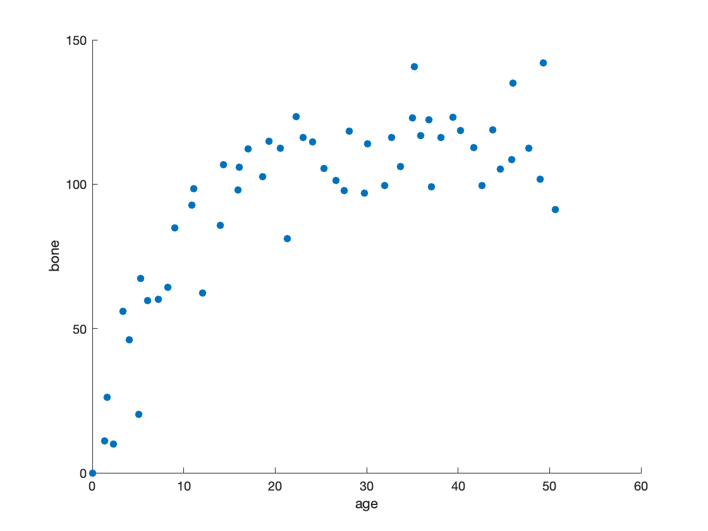
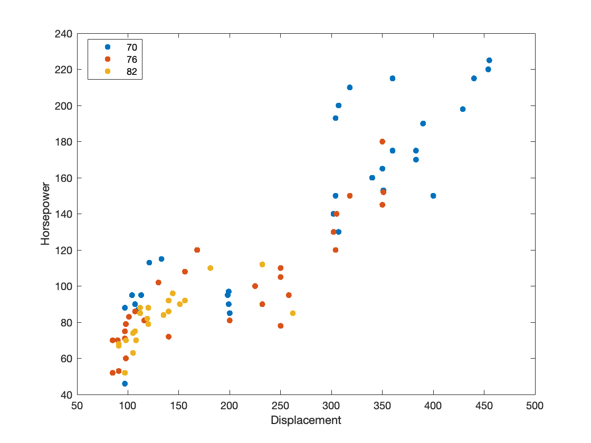

# 03 - Baseline
There are a handful of interesting dichotomies in statistics - let’s dive into some of them so that we have context for when we dive more into the details. 

### Descriptive versus Inferential Statistics

Let’s say I had a dataset that recorded the observation of a shark’s age and the size of their jaw. This raw data isn’t very useful by itself. Reading through all the numbers doesn’t offer much information. Descriptive statistics starts make sense of the data, asking as many questions about the data as possible.  

1. Does the type of shark affect jaw bone size?
2. Does location of the shark affect jaw bone size?
3. How has this data changed over time? 

The more questions the better - it’s common to spend quite a bit of time trying to find just one interesting ‘quirk’ in the data. Summaries, data characteristics and data visualizations are very important at this stage. In fact, visualizations can show the characteristics of data in ways that aren’t evident otherwise. For instance, in this scatterplot we start to see that the trend is not linear - shark jaws tend to grow quickly until about the age of 16, and then averages about 110 units, with three outliers on the upper end. 

Maybe this is obvious, but descriptive statistics is essential to understanding our data, uncovering avenues of investigation, and figuring out if you need to obtain more or different data. 

Inferential statistics is second step of the process, finding some sort of actionable insight that you can take from the data. Maybe after reviewing results on the shark jaw size, you realize that sand sharks in one location tend to grow larger than sand sharks in another location. Is there an environmental reason for this? Is there further investigation that can be done? How confident are we in our findings? Did we obtain enough samples to ensure that this is not just noise?

Inferential statistics is where we expand upon descriptive statistics, dive deeper into what the data is telling us and find a way to regroup with the real world. Ideally, the process will uncover something that allows us to take action, but many times it does not - and that’s fine. Statistics is an iterative process that continues to explore the data. 

## Numerical versus Categorical Data

Not all data in statistics are numbers. Without categorized data, our ability to glean insights from it is limited. If I have just a list of horsepower and displacement across the United States, there’s only so much I can learn from the pattern. That’s where categorized data comes in. We can group cars with similar characteristics together to find patterns. The graph below plots the horsepower and displacement of cars, but now that we included the model year as a category, we can understand that cars built in 1970 tended towards high horsepower and high displacement, while cars in 1976 and 1982 tended towards low horsepower and low displacement. 

You can see in this simple example how categorized data is essential to the statistical process. Keep in mind, that some methods apply only to numerical data, some only to categorical data, and many to combinations of the two. One of the most important things to learn with statistics is understand the data that you have and the methods you can use with it. 

## Discrete versus Continuous

For numerical values, there are many different data types, especially when delving into ‘big data’ and computer science. One crucial identifier is the difference between discrete and continuous data. 

Discrete numbers are finite integers, sometimes referred to as counting numbers. A family can only have a discrete number of children: zero, one, two, three, etc. This can become problematic when trying to build metrics around our data. If the average number of children per couple is 1.7, what are the implications of this? No household has exactly 1.7 children, so we have to make inferences and be very clear how we interpret our discrete data. 

Continuous data contains an infinite array of values - the limitation is the exactitude with which the data is collected. For instance, weight is continuous data by nature. An individual can be between 131.4 pounds, but if weighed on a more precise scale be listed at 131.4254 pounds. There is an infinite range of values, although for practicality we round continuous data to a standard that matches our needs.

The difference between discrete and continuous data is an important concept, as it impacts the inferences and methodology. 
